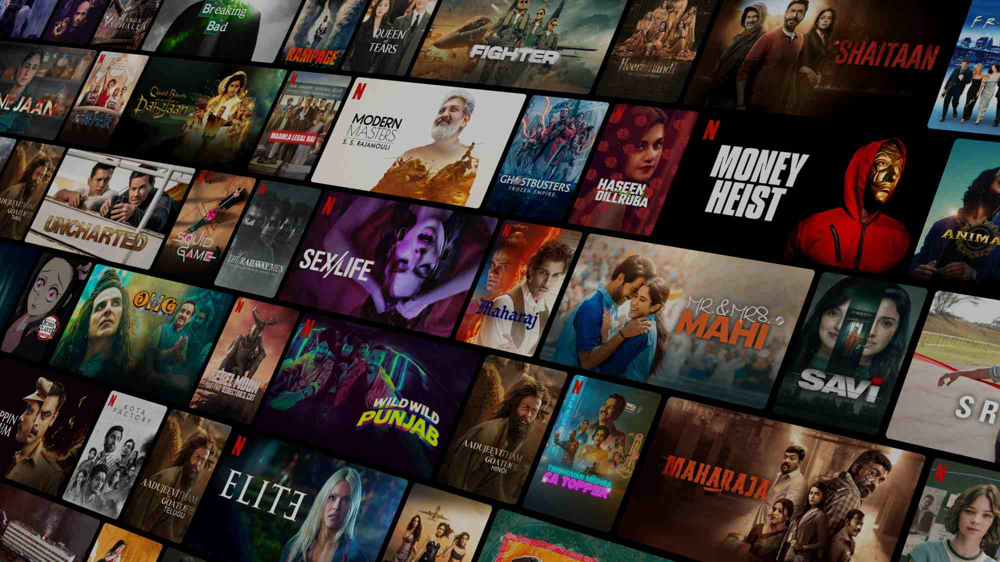

 # Netflix

 ### Prática de Replicação do Layout da Netflix pela AWARI By Fluency. 📚

<a href="https://WallCod.github.io/Layout-Netflix/index.html" target="_blank">Clique aqui</a> para acessar o site.

---

## Sobre o Projeto

Este projeto consiste na criação de um site do tipo “one page” que replica o layout da Netflix. O objetivo principal é aplicar e consolidar conhecimentos adquiridos em desenvolvimento web, proporcionando uma experiência prática e desafiadora. Através deste projeto, buscamos explorar técnicas modernas de design e desenvolvimento, garantindo uma interface atraente e funcional.

---

## Tecnologias utilizadas

- HTML5
- CSS3
- Markdown
- JavaScript

---

## Autor

- 🦁

- [Wallax Figueiredo](https://www.linkedin.com/in/wallax-figueiredo-41116b285/)

